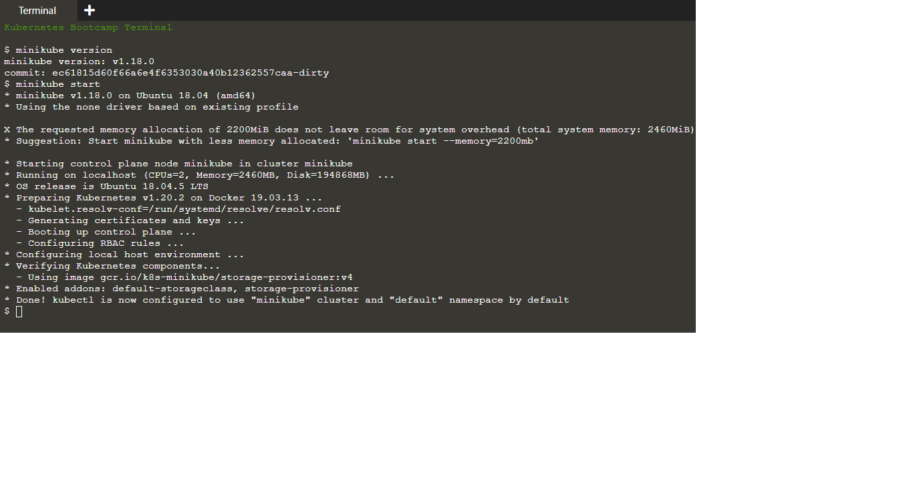

# Create-Kubernetes-cluster
:computer: Create Kubernetes Cluster

### Cluster em funcionamento
Verifique se o Minikube está instalado corretamente, executando o comando minikube version:

```
minikube version
```

### Execução
Inicie o cluster executando o comando minikube start:

```
minikube start
```



Excelente! Agora você tem um cluster Kubernetes em execução em seu terminal online. O Minikube iniciou uma máquina virtual para você e um cluster Kubernetes agora está sendo executado nessa VM.

### Versão do cluster
Para interagir com o Kubernetes durante este bootcamp, usaremos a interface de linha de comando, kubectl. Para verificar se o kubectl está instalado, você pode executar o comando kubectl version:

```
kubectl version
```

```
Client Version: version.Info{Major:"1", Minor:"20", GitVersion:"v1.20.4", GitCommit:"e87da0bd6e03ec3fea7933c4b5263d151aafd07c", GitTreeState:"clean", BuildDate:"2021-02-18T16:12:00Z", GoVersion:"go1.15.8", Compiler:"gc", Platform:"linux/amd64"}
Server Version: version.Info{Major:"1", Minor:"20", GitVersion:"v1.20.2", GitCommit:"faecb196815e248d3ecfb03c680a4507229c2a56", GitTreeState:"clean", BuildDate:"2021-01-13T13:20:00Z", GoVersion:"go1.15.5", Compiler:"gc", Platform:"linux/amd64"}
```

OK, o kubectl está configurado e podemos ver tanto a versão do cliente quanto a do servidor. A versão do cliente é a versão kubectl; a versão do servidor é a versão do Kubernetes instalada no mestre. Você também pode ver detalhes sobre a compilação.

### Detalhes do cluster
Vamos ver os detalhes do cluster. Faremos isso executando kubectl cluster-info:

```
kubectl cluster-info
```

Durante este tutorial, vamos nos concentrar na linha de comando para implantar e explorar nosso aplicativo. Para visualizar os nós no cluster, execute o comando kubectl get nodes:

```
kubectl get nodes
```

Este comando mostra todos os nós que podem ser usados para hospedar nossos aplicativos. Agora temos apenas um nó e podemos ver que seu status está pronto (está pronto para aceitar aplicativos para implantação).
